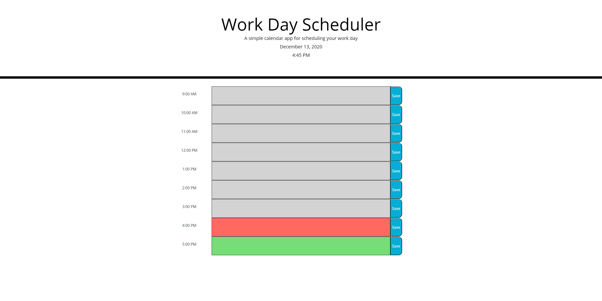

# Work-Day-Scheduler

## Description

This repository contains my completed code for week 5's homework. In this week's homework, we were tasked with creating a work day planner that anyone can use to keep track of their schedule during work hours. 

## Screen Shot of Completed Work

## Link to Deployed Application

https://mrosavourazeris.github.io/Work-Day-Scheduler/